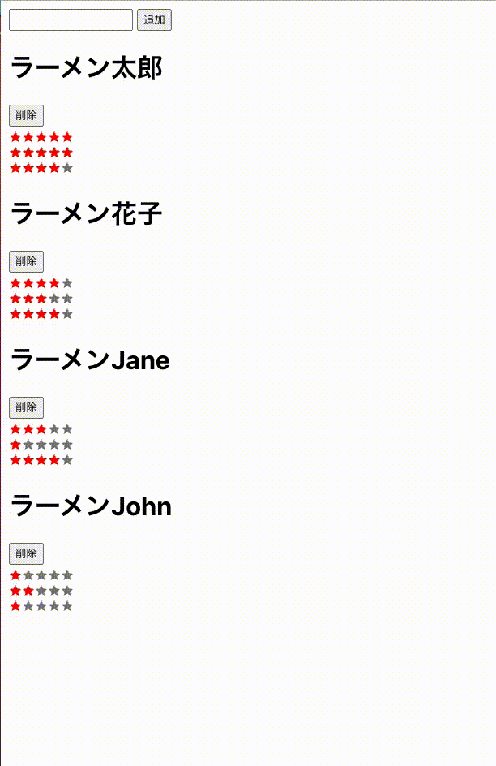

# typescript-react-rating-stars

React(useState) を使ったレーティング（＋追加、削除）サンプル



## Run

```
npm start
```

## Build

```
npm run build
```

## Testing

```
npm test
```

## Install Memo

```
npx create-react-app . --template typescript
```

```
npm install react-icons
npm install -D @types/react-icons
```
